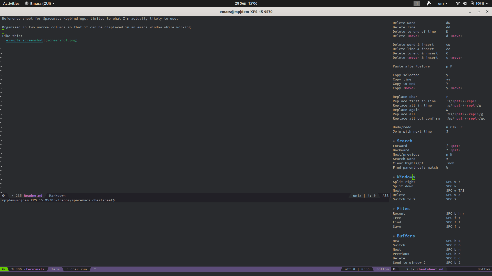

Reference sheet for Spacemacs keybindings, limited to what I'm actually likely to use.

Organised in two narrow columns so that it can be displayed in an emacs window while working. 

Like this:

 
